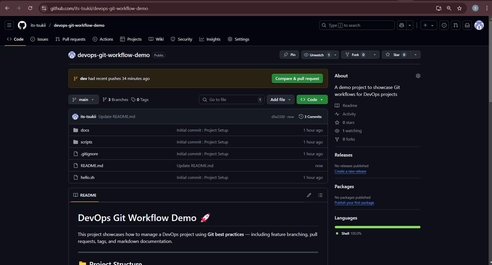
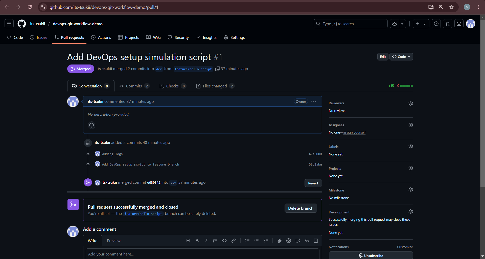
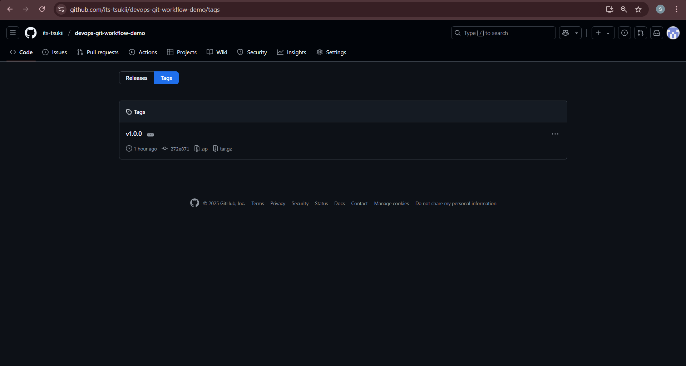
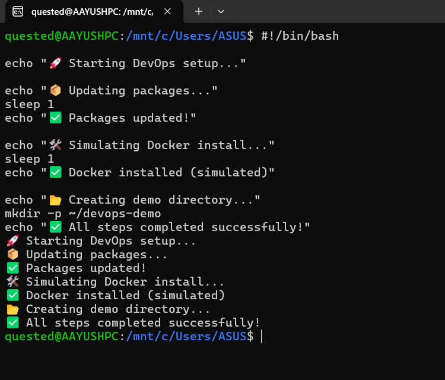

# DevOps Git Workflow Demo 🚀

This project showcases how to manage a DevOps project using **Git best practices** — including feature branching, pull requests, tags, and markdown documentation.

---

## 📁 Project Structure

. ├── scripts/ 
<br>│ └── hello.sh # Simulated DevOps setup script 
<br>├── docs/ 
<br>│ └── git-commands.md # Markdown notes on Git workflow 
<br>├── screenshots/ # Visual proof of Git flow 
<br>├── .gitignore 
<br>├── README.md 
<br>└── execution-log.txt # (Optional log of Git commands)

---

## 🧠 Git Workflow Demonstrated

| Step | Action |
|------|--------|
| 🔧 Init | `git init`, first commit on `main` |
| 🌱 Branch | Created `dev` and `feature/hello-script` |
| ✍️ Commit | Script added in `feature/hello-script` |
| 🔀 Pull Request | Merged feature → dev |
| 🏷️ Tag | Version tagged as `v1.0.0` |
| 🔁 Final PR | `dev` → `main` for release |

---

## 🛠️ Script Overview

### `scripts/hello.sh`

```bash
#!/bin/bash

echo "🚀 Starting DevOps setup..."

echo "📦 Updating packages..."
sleep 1
echo "✅ Packages updated!"

echo "🛠️ Simulating Docker install..."
sleep 1
echo "✅ Docker installed (simulated)"

echo "📂 Creating demo directory..."
mkdir -p ~/devops-demo
echo "✅ All steps completed successfully!"
This script mimics real DevOps automation with simulated provisioning steps.

```
---

## 📸 Git Workflow Screenshots

### 📂 Repo Structure


### 🔀 Feature Branch PR && ✅ Merged PR


### 🏷️ Tagged Release


### 🧪 Script Output



🏷️ Git Tag Created
The repository has been tagged as v1.0.0 to mark the first stable version of this workflow.

🧾 Git Concepts Practiced
Git initialization

Creating and switching branches

Using feature branches for changes

Creating and reviewing Pull Requests

Version tagging with git tag

Clean commit history

Markdown documentation


🧭 More from My DevOps Journey
This project is part of my ongoing DevOps learning series:
👉 DevOps Master Blog – My Journey So Far : https://medium.com/@sroy10012001/my-devops-internship-journey-with-elevate-labs-30-days-of-learning-d7252e409a20

👨‍💻 Author
Aayush Kukade
🔗 LinkedIn : https://www.linkedin.com/in/aayushkukade/
📂 GitHub : https://github.com/its-tsukii/
